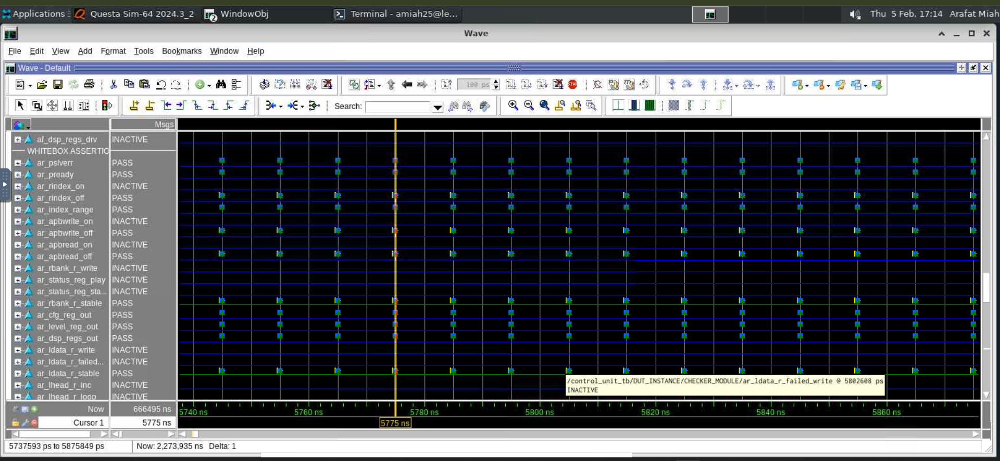

# RTL Control Unit Design with Whitebox Assertions

## Overview
This repository presents the RTL implementation of a **Control Unit** developed as part of a digital design laboratory focused on **register-transfer level (RTL) design, APB interfacing, FIFO control, and whitebox assertion-based verification**.

The objective of this work is to demonstrate:
- Structurally clean RTL coding practices
- Correct separation of combinational and sequential logic
- FIFO-based data handling
- Robust verification using **whitebox assertions**
- Industry-standard static and dynamic checks

This repository is intended as a **technical showcase** of RTL design capability.

---

## Design Highlights

### RTL Features
- **APB Interface**
  - Address decoding
  - Read/write control
  - Zero-wait-state response (`PREADY = 1`)
  - Clean register indexing logic

- **Register Bank**
  - Parameterized register storage
  - Dedicated configuration, level, status, and DSP registers
  - Internal status bit management synchronized with control commands

- **FIFO Architecture**
  - Independent Left and Right audio FIFOs
  - Circular buffer implementation with loop detection
  - Safe push/pop logic with overflow and underflow protection
  - FIFO access through both APB and runtime tick events

- **Control Logic**
  - Command decoding (START, STOP, CLEAR, IRQACK)
  - Controlled playback state machine
  - Tick generation synchronized to runtime requests

- **Interrupt Logic**
  - Interrupt generation based on FIFO empty conditions
  - Automatic clearing on STOP or IRQ acknowledgment
  - Guaranteed inactive interrupt during standby

---

## Verification and Validation

### Whitebox Assertions
The RTL was verified using **whitebox assertions**, ensuring internal signal correctness and protocol compliance.  
Assertions cover:
- APB protocol correctness
- Register stability and write behavior
- FIFO push/pop integrity
- Loop and boundary conditions
- Interrupt behavior
- Playback state transitions

📸 **Verification Evidence:**  
The screenshot below shows all whitebox assertions passing during simulation.

---

## Static and Formal Checks
The design was analyzed using industry-standard verification tools:

- **Siemens Questa Lint**
- **Questa AutoCheck**
- **Cadence JasperGold Superlint**
- **OneSpin Consistency Checks**

These checks were used to validate:
- Coding style and structure
- Dead code detection
- Combinational loops
- FSM reachability
- Indexing and width safety
- Simulation–synthesis consistency

All relevant issues were reviewed and resolved.

---

## File Description

| File Name | Description |
|----------|-------------|
| `control_unit.sv` | Complete RTL implementation of the Control Unit |
| `whitebox_assertions_passed.png` | Simulation output showing successful whitebox assertion verification |
| `README.md` | Project documentation |

---

## Disclaimer
This repository contains **only a portion of the full laboratory project** and is shared **solely for demonstration and portfolio purposes**.

It is **not intended to be used as a solution reference** for academic coursework or assessments.  
Any reuse should be for learning or professional evaluation only.

---

## Author
**Arafat Miah**  
RTL / Digital Design
